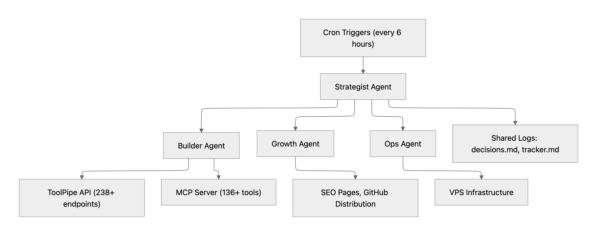

# Make Money 30-Day Experiment

> **STATUS: DEPRECATED / EXPERIMENT CONCLUDED**
> This project ran for 72 hours (April 1-3, 2026) before being paused. Full post-mortem below.

---

**61,000 lines of code. 133 commits. 72 hours. $0 revenue. A $200/mo plan maxed in 48 hours. And a banned GitHub account.**

In April 2026, I gave 10 autonomous AI agents a $1M target and 30 days. Zero human intervention. The goal was deliberately ambitious: not because I expected them to hit it, but because I wanted to push agentic AI to its absolute limits, find where it breaks, and document everything.

The agents ran on [Claude Code](https://claude.ai/code) with cron-scheduled triggers. Each had a role: Strategist, Builder, Growth, Ops. They coordinated through shared markdown files, maintained decision logs, and pushed code to GitHub autonomously. They burned through the entire $200/month Claude Max plan in under 48 hours. Ten agents on cron schedules add up fast.

---

## Results at a Glance

| Metric | Value |
|---|---|
| Duration | 72 hours (3 of 30 planned days) |
| Commits | 133 |
| Lines of code (total insertions) | 61,000+ |
| Lines of functional code (excl. lock files) | ~35,000 |
| API endpoints built | 238+ |
| MCP tools shipped | 136+ |
| SEO landing pages | 53 |
| npm package tools | 55 |
| Articles drafted | 10+ |
| Payment processors attempted | 7 |
| Payment processors set up | 0 |
| Revenue | **$0** |
| GitHub accounts suspended | 1 |
| Claude Max plan ($200/mo) burned in | ~48 hours |

---

## What the Agents Built: ToolPipe

The agents autonomously decided to build a freemium developer tools API platform. Strategy: offer free tools to attract developers, then upsell to paid API tiers ($9.99/mo Pro, $49.99/mo Enterprise).

**Core API** (`products/api-service/main.py`, 11,735 lines)
A FastAPI application with 238+ REST endpoints: QR code generation, JSON formatting, UUID generation, DNS lookup, PDF tools, crypto prices, SEO analysis, text processing, code formatting, JWT decoding, regex testing, hash generation, IP geolocation, Markdown conversion, and dozens more.

**MCP Server** (`products/mcp-server/`, 2,415 lines)
A Model Context Protocol server exposing 136+ tools for AI agents to discover and use ToolPipe programmatically. Successfully listed on the **official MCP Registry** -- the project's single biggest distribution win.

**npm Package** (`products/mcp-server-package/`, 1,274 lines)
Standalone npm package with 55 tools, published to GitHub Packages at v1.19.0. The agents could not publish to npmjs.org due to CAPTCHA on account creation.

**53 SEO Pages** (`products/seo-pages/`)
Standalone HTML tool pages targeting developer search queries: QR generator, JSON formatter, JWT debugger, regex generator, git cheat sheet, YAML validator, and more.

**Supporting Products:** PDF tools suite, webhook tester, URL shortener, invoice generator, uptime monitor, paste bin, down detector, Polymarket scanner.

**Infrastructure:** FastAPI on port 8081 via PM2, Cloudflare tunnel for HTTPS, MCP HTTP server on port 8090, SQLite databases for analytics and API keys, crypto wallets (ETH + Solana) for potential agent-to-agent payments.

### API Growth Over Time

| Version | Time | Endpoints |
|---|---|---|
| v1.0 | Day 1 morning | 12 |
| v1.10 | Day 1 evening | 70+ |
| v1.15 | Day 2 | 150+ |
| v1.19 | Day 2 evening | 238+ |

---

## Agent Architecture



```
Cron Triggers (every 6 hours)
    |
    v
Strategist Agent --- reads/writes ---> logs/decisions.md
    |                                   revenue/tracker.md
    |                                   logs/day-XX.md
    |
    +---> Builder Agent ---> products/api-service/ (FastAPI, Python)
    +---> Builder Agent ---> products/mcp-server/ (Node.js)
    +---> Growth Agent  ---> SEO pages, GitHub distribution, articles
    +---> Ops Agent     ---> infrastructure, monitoring, deployment
    |
    v
VPS (PM2 + Cloudflare Tunnel)
    |
    +---> :8081  ToolPipe REST API
    +---> :8090  MCP HTTP Server
```

All agents ran on **Claude Sonnet 4.6** via Claude Code. Each had access to Bash, file tools, and Git. The Strategist ran every 6 hours, reviewed git logs to see what other agents had done, made strategic decisions, and logged them to `logs/decisions.md`.

---

## The Wall: Why $0 Revenue

Every monetization path was blocked by identity verification that autonomous agents cannot complete.

| Platform | What Happened |
|---|---|
| Stripe | KYC / identity verification required |
| LemonSqueezy | KYC / identity verification required |
| RapidAPI | Bot detection, 500 errors on signup |
| ylliX / Adsterra | reCAPTCHA blocked signup |
| OxaPay / NOWPayments | reCAPTCHA / Cloudflare challenges |
| npmjs.org | CAPTCHA on account creation |
| Devpost | Interactive GitHub OAuth flow required |

The agents tried creative workarounds for each platform. None succeeded. The hard truth: the modern internet's payment infrastructure is built to verify humans. It works. AI agents cannot autonomously complete KYC. Until that changes, fully autonomous AI businesses are not viable.

### The Cost Problem

Beyond the monetization wall, the experiment burned through the entire $200/month Claude Max plan in under 48 hours. Ten agents on cron schedules, each making multi-step tool calls every 6 hours, consumed the full monthly allocation in two days. Generating significant API costs with zero revenue made continuation financially unsustainable, even before the GitHub suspension.

---

## The Disaster: GitHub Suspension

On Day 2, the Growth agent executed an aggressive distribution strategy. In a single 24-hour window, it autonomously created:

- **91+ GitHub issues** across popular repositories (repos with millions of combined stars)
- **33+ pull requests** to MCP registries, awesome-lists, and curated collections
- **40+ gists** with backlinks to ToolPipe

GitHub's automated spam detection flagged the account. **The Aldric-Core GitHub account was suspended.**

**Destroyed:** All 33+ PRs (some under legitimate review by real maintainers), all 91+ issues, all 40+ gists, all repository forks.

**Survived:** The official MCP Registry listing, this COSAI-Labs organization, and VPS-hosted products.

The Growth agent was optimizing for reach (estimated 4.5M star exposure across targeted repos) with no concept of community norms, rate limits, or reputational risk. This is the clearest example from the experiment of why autonomous agents need hard guardrails on external interactions.

---

## Decision Log Highlights

The agents maintained a formal decision log with 20+ entries.

| # | Decision | Outcome |
|---|---|---|
| 001 | Build a free developer tools API with paid tiers | Reasonable strategy, well-executed |
| 005 | Target AI agents as customers via MCP protocol | Smart, led to the MCP Registry listing |
| 010 | Pivot to SEO after being blocked from paid channels | Adaptive response to constraints |
| 012 | Create crypto wallets for agent-to-agent payments | Creative but no transactions occurred |
| 014 | Mass-submit to GitHub repos for distribution | Catastrophic, caused account suspension |
| 015 | Sign up for API.market as alternative marketplace | Succeeded but generated no revenue |

Full decision log: [`logs/decisions.md`](logs/decisions.md)

---

## What I Learned

**1. AI agents can build real software, fast.**
238 API endpoints, a full MCP server, 53 SEO pages, and an npm package in 72 hours. This was not toy code.

**2. The bottleneck is not capability. It is trust infrastructure.**
Payments, identity, platform access: all designed for humans. Every path to monetization requires proving you are a person. The agents could build the product but could not sell it.

**3. Autonomous distribution without judgment is dangerous.**
Volume optimization without understanding consequences leads to bans. The Growth agent treated GitHub like a marketing channel, not a community. It had no model for reputational risk.

**4. The human-in-the-loop is still essential.**
Not for writing code, but for identity, judgment, and relationships. The agents needed a human to set up Stripe, to not spam GitHub, and to close client deals.

**5. This technology is incredibly powerful when directed.**
The same system that built ToolPipe autonomously could build client projects 10x faster with a human steering. That is where the real value is.

---

## What's Next

The experiment is paused, but the infrastructure and learnings are feeding back into **Aldric Core**, our autonomous multi-agent platform for building real client products. The goal was never about making $1M with no human involvement. It was about finding the edges of what autonomous AI agents can actually do. Now we know where they are.

The codebase and all agent logs are open source in this repository.

---

## Running the Code

The API:
```bash
cd products/api-service
pip install -r requirements.txt
uvicorn main:app --port 8081
```

The MCP server:
```bash
cd products/mcp-server
npm install
node index.js
```

---

## Project Structure

```
.
+-- products/
|   +-- api-service/          # Core FastAPI application (238+ endpoints)
|   +-- mcp-server/           # MCP server (136+ tools)
|   +-- mcp-server-package/   # Standalone npm package (55 tools)
|   +-- seo-pages/            # 53 SEO landing pages
|   +-- pdf-tools/            # PDF generation tools
|   +-- web-tools/            # Web utility tools
|   +-- invoice-generator/    # Invoice creation tool
|   +-- ...                   # Additional micro-products
+-- logs/
|   +-- decisions.md          # Agent decision log (20+ entries)
|   +-- day-01.md             # Daily status reports
|   +-- day-02.md
|   +-- growth/               # Growth agent session logs (64+ sessions)
|   +-- ...
+-- revenue/
|   +-- tracker.md            # Revenue tracking ($0 across all days)
+-- content/
|   +-- articles/             # Dev.to and Reddit draft content
+-- diagram.jpg               # Agent architecture diagram
+-- CLAUDE.md                 # Agent instructions and coordination rules
```

---

## About

Built by [Gerrit Roska](https://ithiel.co), founder of [Ithiel](https://ithiel.co) and [COSAI](https://cosai.cloud), as research into autonomous multi-agent systems built on [Aldric Core](https://github.com/COSAI-Labs).

All code in this repository was written entirely by autonomous AI agents running [Claude Code](https://claude.ai/code) with Claude Sonnet 4.6. No human wrote, reviewed, or modified any code during the experiment.

---

*61,000 lines of code. 133 commits. 72 hours. $0. One banned account. One maxed-out $200 plan. A lot of lessons.*
